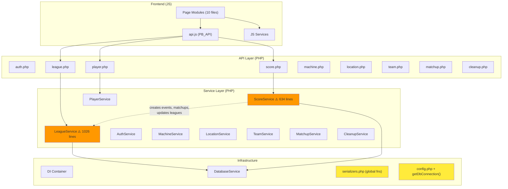

# PinBowling Structural Review

A comprehensive review of the project's architecture, identifying structural issues and refactoring opportunities that will become increasingly painful as the project grows.

---

## Summary

The codebase is in **good shape overall** — it has a clear service layer, a DI container, proper separation of API controllers from business logic, a PSR-7-inspired `Request` object, and consistent serialization. The issues below are not bugs — they're **structural patterns that will compound as scope increases**.

---

## 🔴 High Priority — Will Bite You First

### 1. LeagueService is a God Object (1,026 lines)

[LeagueService.php](file:///c:/Users/kylev/development/antigravity/pinbowling/service/LeagueService.php) manages leagues, seasons, events, rosters, matchups, teams, and playoffs — all in one class. At 1,026 lines, it's already the single largest file in the backend and it's only going to grow.

**What breaks as you scale:**
- Adding any new league type, event variant, or scoring mode means modifying this monolith
- The round-robin scheduling logic (`startSeason`, `updateSeason`) is ~400 lines of procedural code embedded inline
- Testing any single feature requires bootstrapping the entire service

**Recommended decomposition:**

| New Service | Responsibility | Lines moved |
|---|---|---|
| `SeasonService` | `startSeason()`, `updateSeason()`, round-robin generation | ~400 |
| `PlayoffService` | `startPlayoffs()`, bracket seeding | ~120 |
| `EventService` | CRUD for events (already half-orphaned in `LeagueService`) | ~100 |
| `RosterService` | `addPlayerToLeague()`, `removePlayerFromLeague()`, roster queries | ~60 |

`LeagueService` would remain as a thin coordinator for league-level CRUD and metadata.

---

### 2. Massive Code Duplication: Machine Selection Logic

The "select random machines for matchups" block is **copy-pasted 5 times** across the codebase:

| Location | File | Line range |
|---|---|---|
| `startSeason()` | [LeagueService.php](file:///c:/Users/kylev/development/antigravity/pinbowling/service/LeagueService.php#L628-L640) | ~L628-640 |
| `updateSeason()` | [LeagueService.php](file:///c:/Users/kylev/development/antigravity/pinbowling/service/LeagueService.php#L842-L853) | ~L842-853 |
| `startPlayoffs()` | [LeagueService.php](file:///c:/Users/kylev/development/antigravity/pinbowling/service/LeagueService.php#L971-L982) | ~L971-982 |
| `handlePlayoffAdvancement()` | [ScoreService.php](file:///c:/Users/kylev/development/antigravity/pinbowling/service/ScoreService.php#L425-L439) | ~L425-439 |
| `advanceToPlayoffRound()` | [ScoreService.php](file:///c:/Users/kylev/development/antigravity/pinbowling/service/ScoreService.php#L481-L503) | ~L481-503 |

Similarly, the "populate matchup innings" INSERT loop is duplicated in all 5 of those same locations.

**Fix:** Extract both into a shared helper, either on a new `MatchupGeneratorService` or as a utility method:

```php
class MatchupGenerator {
    public static function selectMachinesForMatchup(array $allMachineIds, int $count): array { ... }
    public static function createInningSlots(PDO $pdo, int $eventId, int $eventMatchupId, ...): void { ... }
}
```

---

### 3. Services Bypass DatabaseService Internally

You have a `DatabaseService` wrapper with `query()`, `beginTransaction()`, `commit()`, and `rollBack()` — but **most services immediately call `$this->db->getPdo()`** and then use raw PDO directly:

```php
// Pattern found in LeagueService, ScoreService, PlayerService, MachineService, etc.
$pdo = $this->db->getPdo();
$pdo->beginTransaction();
$stmt = $pdo->prepare('...');
```

This means `DatabaseService` is effectively just a PDO holder. The `query()` helper is barely used, and transaction management goes around it.

**Why this matters:**
- You can't add cross-cutting concerns (query logging, slow query detection, metrics) without touching every service
- If you ever want to swap PDO for a different adapter or add connection pooling, every service has raw PDO calls
- The `DatabaseService.query()` method exists but isn't used consistently — some services use it, others don't (compare [ScoreService.php](file:///c:/Users/kylev/development/antigravity/pinbowling/service/ScoreService.php#L25) vs [LeagueService.php](file:///c:/Users/kylev/development/antigravity/pinbowling/service/LeagueService.php#L26))

**Fix:** Commit to using `$this->db->query()` everywhere, and add a `$this->db->execute()` variant for statements that don't return rows. Stop exposing `getPdo()` except where truly necessary (e.g., `lastInsertId()`).

---

### 4. Dual PDO Initialization Paths (Legacy Foot-gun)

[config.php](file:///c:/Users/kylev/development/antigravity/pinbowling/includes/config.php#L73-L94) has a `getDbConnection()` function that creates its own PDO instance as a fallback when the container isn't available. This means:

1. **Two different PDO connections** can exist simultaneously — one from the DI container, one from the legacy function
2. If any file still calls `getDbConnection()` instead of going through the container, it gets a separate connection (separate transaction state, separate prepared statement cache)
3. The `$mockPdo` parameter creates a hidden global test seam that's easy to forget about

**Fix:** Deprecate `getDbConnection()` and audit for any remaining callers. All database access should go through the container's `DatabaseService`.

---

## 🟡 Medium Priority — Friction as Features Grow

### 5. Procedural Serializers with Global Functions

[serializers.php](file:///c:/Users/kylev/development/antigravity/pinbowling/includes/serializers.php) defines 10 global functions (`serializePlayer`, `serializeLeague`, etc.) with no namespace and no class. 

**Problems:**
- Can't be autoloaded — requires `require_once` everywhere
- Can't be dependency-injected or mocked in tests
- No type safety or contracts — any change to the return shape is invisible until runtime
- Growing: every new entity adds another global function

**Fix:** Group them into a `Serializer` class (or per-entity serializer classes). Even a single static class would be a major improvement.

---

### 6. API Controllers Are Flat Procedural Files

Each file in [api/](file:///c:/Users/kylev/development/antigravity/pinbowling/api) follows the same pattern:
```php
require_once bootstrap.php;
$container = $GLOBALS['container'];
switch ($method) { ... }
```

**Problems:**
- No shared base controller or middleware pipeline — auth checks are ad-hoc (`validateAdminAccess()`, `validateTDAccess()`) and must be remembered per-route
- Input validation is inline and inconsistent (some endpoints check `empty()`, others check `isset()`)
- Error handling varies: [league.php](file:///c:/Users/kylev/development/antigravity/pinbowling/api/league.php#L208) catches `\Throwable`, [player.php](file:///c:/Users/kylev/development/antigravity/pinbowling/api/player.php#L182) catches `Exception`
- The `task` query parameter is doing the job of proper sub-routing

**Not saying you need a framework**, but a thin controller base class would reduce boilerplate:
```php
abstract class ApiController {
    protected Container $container;
    protected array $input;
    abstract protected function handleGet(): void;
    abstract protected function handlePost(): void;
    // ... shared error handling, auth, CSRF
}
```

---

### 7. Cross-Service Leakage in ScoreService

[ScoreService.php](file:///c:/Users/kylev/development/antigravity/pinbowling/service/ScoreService.php) has `handlePlayoffAdvancement()` and `advanceToPlayoffRound()` — these methods create **events, matchups, and update league status**. This means:

- `ScoreService` reaches into `events`, `event_matchups`, `matchups`, and `leagues` tables directly
- It duplicates logic that belongs in `LeagueService` (or a future `PlayoffService`)
- A change to how events are created requires editing both `LeagueService.createEvent()` AND the inline INSERT in `ScoreService.advanceToPlayoffRound()`

**Fix:** `ScoreService` should emit an event/call a method on `LeagueService`/`PlayoffService` to handle advancement, rather than managing the bracket internally.

---

### 8. `SET FOREIGN_KEY_CHECKS = 0` Is Dangerous

This pattern appears in [LeagueService.php](file:///c:/Users/kylev/development/antigravity/pinbowling/service/LeagueService.php#L343) `deleteLeague()`, `deleteEvent()`, and `updateSeason()`:

```php
$pdo->exec("SET FOREIGN_KEY_CHECKS = 0");
// ... do deletes ...
$pdo->exec("SET FOREIGN_KEY_CHECKS = 1");
```

**Problems:**
- If an exception is thrown between the SET statements, FK checks stay disabled for the connection
- The catch blocks do re-enable FK checks, but if PHP fatals (OOM, timeout), they won't run
- It masks data integrity issues that FK constraints are designed to catch
- It's a session-level setting — affects all queries on that connection, not just the transaction

**Fix:** Delete related records in the correct dependency order instead of disabling FK checks. The code already does this (deletes child records before parents) — the `SET FOREIGN_KEY_CHECKS` is redundant and dangerous.

---

### 9. Event Matchup References in PlayerService.mergePlayers() Are Incomplete

[PlayerService.mergePlayers()](file:///c:/Users/kylev/development/antigravity/pinbowling/service/PlayerService.php#L245-L371) updates `scores`, `league_players`, `team_members`, `matchups`, and `users` — but **doesn't update `event_matchups`** (`home_player_id`, `away_player_id`, `winner_id`).

After a merge, the `event_matchups` table still references the deleted player's ID, which means:
- Historical matchup views will show a broken/missing player name
- Winner references become dangling foreign keys
- Any query JOINing `event_matchups` to `players` will lose rows

---

## 🟢 Lower Priority — Good Practices to Adopt

### 10. camelCase / snake_case Inconsistency in Data Layer

The serializers have defensive fallbacks like:
```php
'playerName' => $row['player_name'] ?? $row['playerName'] ?? null,
'weeksInSeason' => $league['weeks_in_season'] ?? $league['weeksInSeason'] ?? 0,
```

This suggests that **different code paths return data in different naming conventions**. The `getLeague()` method returns `snake_case` from the database, but some internal methods produce `camelCase`. This dual-convention forces every consumer to handle both, which is fragile.

**Fix:** Standardize on `snake_case` from the database layer and transform to `camelCase` once in the serializer. Remove the fallback chains.

---

### 11. Large Frontend Page Files

Several JS page modules are very large:

| File | Lines | Size |
|---|---|---|
| [leaguesPage.js](file:///c:/Users/kylev/development/antigravity/pinbowling/scripts/pages/leaguesPage.js) | ~40K | Large monolith |
| [scoresPage.js](file:///c:/Users/kylev/development/antigravity/pinbowling/scripts/pages/scoresPage.js) | ~38K | Large monolith |
| [playPage.js](file:///c:/Users/kylev/development/antigravity/pinbowling/scripts/pages/playPage.js) | ~25K | |
| [standingsPage.js](file:///c:/Users/kylev/development/antigravity/pinbowling/scripts/pages/standingsPage.js) | ~23K | |
| [eventSetupPage.js](file:///c:/Users/kylev/development/antigravity/pinbowling/scripts/pages/eventSetupPage.js) | ~23K | |

These would benefit from extracting reusable rendering and state logic into the existing `renderers/` and `services/` directories.

---

### 12. Router Class Has No Namespace

[Router](file:///c:/Users/kylev/development/antigravity/pinbowling/includes/router.php) is the only class defined without a namespace (`class Router`), while everything else uses `App\...`. This will cause issues if you ever add a second Router or if autoloading is tightened.

---

## Architecture Diagram (Current)



---

## Prioritized Action Items

| # | Issue | Effort | Impact |
|---|---|---|---|
| 1 | Extract `MatchupGenerator` helper (machine selection + inning creation) | Small | Eliminates 5x duplication |
| 2 | Fix `mergePlayers()` to update `event_matchups` | Small | Prevents data integrity bug |
| 3 | Remove `SET FOREIGN_KEY_CHECKS = 0` usage | Small | Prevents silent corruption |
| 4 | Deprecate `getDbConnection()` legacy function | Small | Removes dual-connection risk |
| 5 | Split `LeagueService` into focused services | Medium | Maintainability, testability |
| 6 | Move playoff advancement out of `ScoreService` | Medium | Correct service boundaries |
| 7 | Standardize `DatabaseService` usage (stop using `getPdo()`) | Medium | Enables cross-cutting concerns |
| 8 | Convert serializers to a class with namespace | Medium | Autoloading, testability |
| 9 | Add namespace to `Router` | Small | Consistency |
| 10 | Introduce base API controller | Large | Reduces boilerplate, consistent auth |
