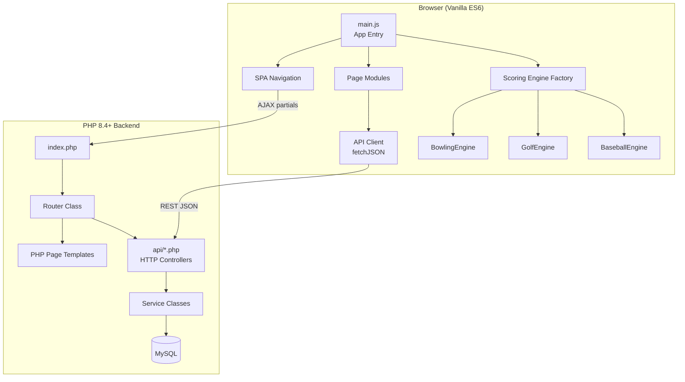
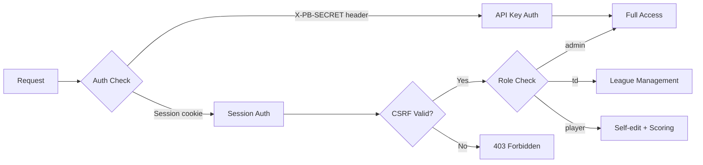
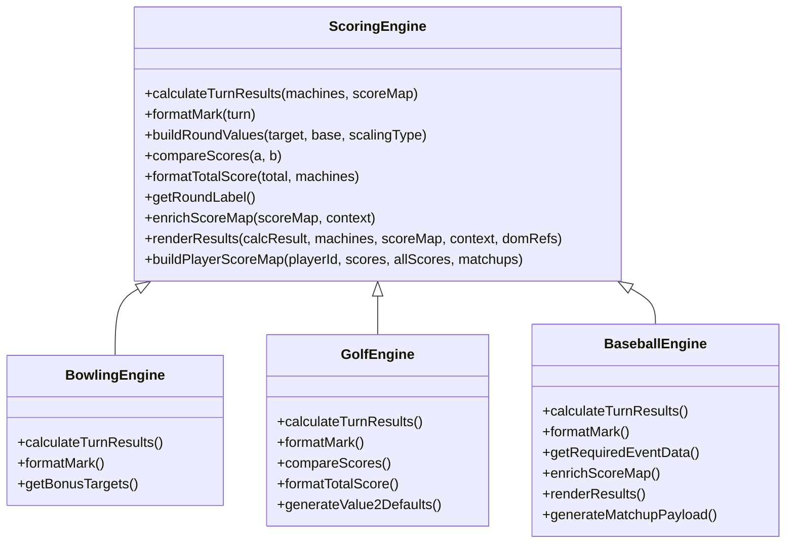
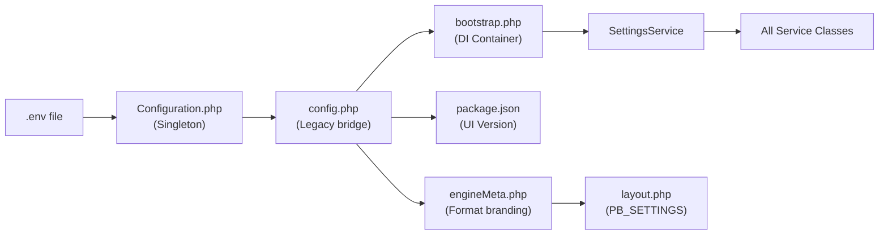

# PinBowling — System Architecture

> Current as of v1.3.6 (July 2026)

## High-Level Overview

PinBowling is a server-rendered SPA hybrid. The PHP backend serves an HTML shell on first load, then the frontend navigates via AJAX partial-page loads. All data operations go through a RESTful API layer backed by service classes.



---

## Backend Architecture

### Request Lifecycle

1. **Entry** — All requests enter through `index.php`
2. **Bootstrap** — `includes/bootstrap.php` initializes the DI container, autoloader, and registers all services
3. **Routing** — `Router::resolve()` parses the URL, handles versioned assets, applies auth guards, and maps to a handler
4. **Dispatch** — The router returns one of: `page` (template), `service` (API), `static` (asset), `redirect`, or `error`
5. **Layout** — Page templates are wrapped in `layout.php` for full loads, or returned bare for AJAX partials

### Dependency Injection Container

A lightweight custom container (`includes/Container.php`) manages all service instances with lazy factory resolution:

| Service | Responsibility |
|---------|---------------|
| `SettingsService` | Runtime configuration values (DB, secrets, version) |
| `DatabaseService` | PDO connection wrapper |
| `AuthService` | Login, registration, password reset, session management |
| `PlayerService` | Player CRUD, role management, profile updates |
| `LeagueService` | League/event CRUD, roster management, season config |
| `EventService` | Individual event creation and lookup |
| `SeasonService` | Season start/update logic, round-robin scheduling, team batting rotation |
| `PlayoffService` | Individual postseason bracket creation and series advancement |
| `TeamPlayoffService` | Team postseason bracket creation, series advancement, home/away alternation |
| `EventService` | Individual event creation and lookup |
| `MatchupGenerator` | Shared helper for creating round/matchup fixtures (static) |
| `LocationService` | Venue management, machine-to-location mapping |
| `MachineService` | Master machine registry, target score thresholds |
| `ScoreService` | Score recording and retrieval |
| `TeamScoreService` | Team score recording, lineup ball-to-player assignment |
| `TeamService` | Team CRUD, member and league assignment |
| `RosterService` | League roster management (players, staff, locations) |
| `MatchupService` | Individual head-to-head matchup management (Baseball format) |
| `TeamMatchupService` | Team head-to-head matchup management (Baseball format) |
| `SessionService` | Quick Play session creation and lifecycle |
| `TargetResolver` | Machine target score resolution (global → location override) |
| `CleanupService` | Session data cleanup |

### API Layer

API endpoints live in `api/` and follow a consistent pattern:
- Thin HTTP controllers that parse request parameters and delegate to service classes
- Separate controllers for individual (`api/matchup.php`) vs team (`api/team-matchup.php`) head-to-head management
- Use `?task=` query parameter for sub-resource routing (e.g., `league.php?task=fixture`)
- Responses normalized through `Serializer::*` functions in `includes/Serializer.php`
- Auth enforced by calling `validateAdminAccess()`, `validateTDAccess()`, or `validateSessionOrSecret()` guards

### Authentication & Authorization



**Roles:**
- **admin** — Full system access, user management, league deletion
- **td** (Tournament Director) — League and event management, player management
- **player** — Self-profile editing, score entry, session participation

### Database Schema

Core tables managed by `migrate.php`:

See `docs/database_schema.md` for the full ER diagram. Key relationships:

- `leagues` → `events` (one-to-many)
- `leagues` → `league_players` / `league_teams` / `league_locations` / `league_staff` (roster)
- `events` → `scores` / `target_scores` (records + thresholds)
- Individual H2H: `events` → `event_matchups` → `matchups` (individual head2head pairings & half-inning slots)
- Team H2H: `events` → `team_event_matchups` → `team_matchups` & `team_scores` (team head2head pairings, half-inning slots, and ball-level scores)
- `locations` → `location_machines` → `machines` (machine installation)
- `players` ↔ `users` (optional 1:1 link for auth accounts)

---

## Frontend Architecture

### Module System

The frontend uses native ES6 modules with import maps (defined in `layout.php`) for path aliases:

| Alias | Maps To | Purpose |
|-------|---------|---------|
| `@scripts/` | `/scripts/` | Root scripts |
| `@core/` | `/scripts/core/` | Scoring engines |
| `@pages/` | `/scripts/pages/` | Page initializers |
| `@services/` | `/scripts/services/` | API, auth, state |
| `@ui/` | `/scripts/ui/` | Shared UI components |

### Page Detection Pattern

Instead of route-based code splitting, `main.js` uses DOM element detection to initialize the correct page module:

```javascript
const pageInitializers = {
  'machine-form': initMachinesPage,
  'rounds-input': initScoresPage,
  'standings-body': initStandingsPage,
  // ...
};
Object.entries(pageInitializers).forEach(([id, init]) => {
  if (document.getElementById(id)) init();
});
```

### Scoring Engine Hierarchy



> **Score flow (Baseball):**
> - **Individual:** `BaseballEngine.calculateTurnResults()` returns `homeScore`/`awayScore` — pre-computed matchup totals. The client sends these via `POST /api/score`, and `ScoreService` stores them in `event_matchups.player1_score/player2_score`.
> - **Team:** The same engine computes totals client-side, sent via `POST /api/team-score`, and `TeamScoreService` stores them in `team_event_matchups.team1_score/team2_score`. `TeamScoreService` also updates `team_winner_id` and triggers playoff advancement via `TeamPlayflowService::handlePlayoffAdvancement()` when a game is completed.

### State Management

Minimal state via `localStorage`:
- `currentPlayerId` — Selected player for scoring context
- `pb_debug` — Debug mode toggle
- `pb_preferred_format` cookie — Active scoring format / theme

### SPA Navigation

The app intercepts link clicks in `navigation.js` and uses `loadPage()` (from `utils.js`) to fetch page content via AJAX, inject it into the DOM, and update browser history. The `pb:pageChanged` custom event triggers `initApp()` re-initialization.

---

## Configuration Flow



---

## Testing Architecture

| Layer | Tool | Config | Coverage |
|-------|------|--------|----------|
| **JS Unit** | Vitest + jsdom | `vitest.config.js` | Scoring engines, utils, routes, pages, services |
| **PHP Service** | PHPUnit 13 | `phpunit.xml` | Serializers (limited — see audit) |
| **E2E** | Playwright | `playwright.config.js` | Navigation, page structure, scoring workflows |
| **CI** | GitHub Actions | `.github/workflows/playwright.yml` | Playwright on push/PR |

---

## Deployment Model

- Hosted on shared PHP hosting (Apache)
- SFTP deployment via VS Code extension
- Version in `package.json` drives cache-busting for all static assets
- `.htaccess` handles clean URLs, version stripping, and SPA routing fallback
- Database migrations run manually via `php migrate.php`
