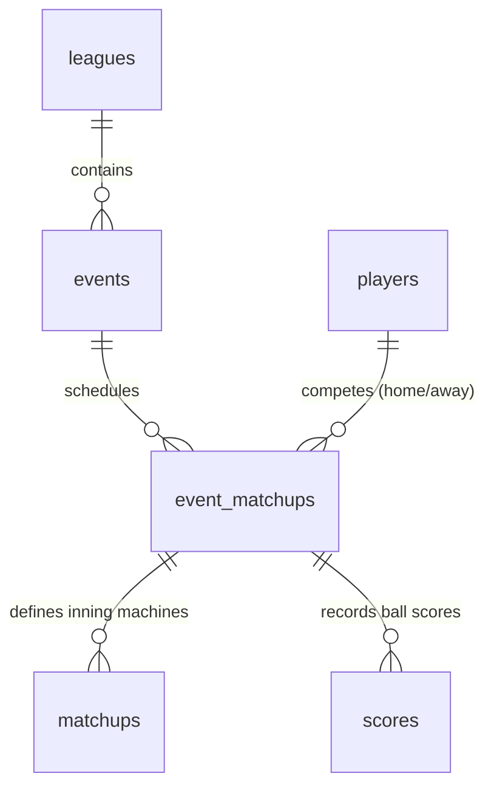

# Baseball Season & Head-to-Head League — Implementation Design

This document details the architectural plan, schema changes, and frontend/backend updates required to implement a multi-player **Baseball Season League** in PinBowling.

---

## 1. Overview & Goals

Currently, the Baseball (PinBaseball) format is restricted to one-off sessions with a maximum of **2 players** (pitcher/batter head-to-head). 
To support full league seasons, we need to allow **$N$ players** to join a league, generate a round-robin schedule over a specified number of weeks, and track weekly head-to-head match results.

### Core Requirements
1. **Head-to-Head Leagues:** Create a league type of "Head to Head" where players are paired each week.
2. **Dynamic UI Fields:** Adapt the league creation page when "Head to Head" is selected:
   - Scoring Format is locked to **Baseball**.
   - **Season Scoring** is removed (head-to-head uses Wins/Losses).
   - **Drop Lowest Weeks** is removed.
   - **Weeks in Season** is shown and required.
3. **Automated Scheduling:** Clicking "Start Season" generates a round-robin schedule for the specified weeks. If a player gets a bye week, it is excluded from win percentage calculations.
4. **Standings by Win %:** Standings display Wins-Losses and Win Percentage (`W / (W + L)`), sorting by Win %.
5. **Matchup View:** The league page must display matchups week-by-week with scores. Clicking a matchup navigates to the scoring page for that specific game.
6. **Playoffs Bracket:** A postseason step where users specify qualified players and series length (Single Game, Best of X) to generate a tournament bracket.

---

## 2. Database Schema Changes

To allow multiple head-to-head matchups within a single weekly event, we must introduce an `event_matchups` table and modify the existing `matchups` and `scores` tables.



### 2.1. New Table: `event_matchups`
This table represents a high-level head-to-head match between two players in a given week (event).

```sql
CREATE TABLE IF NOT EXISTS `event_matchups` (
  `id` INT AUTO_INCREMENT PRIMARY KEY,
  `event_id` INT NOT NULL,
  `home_player_id` INT NOT NULL,
  `away_player_id` INT DEFAULT NULL, -- NULL represents a BYE week
  `home_runs` INT DEFAULT 0,
  `away_runs` INT DEFAULT 0,
  `winner_id` INT DEFAULT NULL,
  `status` ENUM('pending', 'completed') DEFAULT 'pending',
  `game_number` INT DEFAULT 1, -- Supports Best-of-X playoff games
  CONSTRAINT `fk_em_event` FOREIGN KEY (`event_id`) REFERENCES `events` (`id`) ON DELETE CASCADE,
  CONSTRAINT `fk_em_home` FOREIGN KEY (`home_player_id`) REFERENCES `players` (`id`) ON DELETE CASCADE,
  CONSTRAINT `fk_em_away` FOREIGN KEY (`away_player_id`) REFERENCES `players` (`id`) ON DELETE CASCADE,
  CONSTRAINT `fk_em_winner` FOREIGN KEY (`winner_id`) REFERENCES `players` (`id`) ON DELETE CASCADE
) ENGINE=InnoDB DEFAULT CHARSET=utf8mb4;
```

### 2.2. Modified Table: `matchups`
Currently, `matchups` defines machine assignments for a whole event, assuming only 2 players. We must link these details to a specific head-to-head pairing.

- **Add Column:** `event_matchup_id INT DEFAULT NULL`
- **Drop Index:** `unique_matchup` (`event_id`, `order_number`, `player_order`)
- **Add Index:** `unique_event_matchup_slot` (`event_matchup_id`, `order_number`, `player_order`)
- **Add Constraint:** Foreign key to `event_matchups` (`id`) ON DELETE CASCADE.

> [!NOTE]
> `event_id` remains in `matchups` for backward compatibility with older session-type games.

### 2.3. Modified Table: `scores`
Inning-by-inning scores must be associated with the specific game to avoid conflicts (especially in Best-of-X playoff scenarios where the same players play multiple games in the same week).

- **Add Column:** `event_matchup_id INT DEFAULT NULL`
- **Modify Unique Key:** Change `unique_player_round` from (`event_id`, `player_id`, `order_number`) to (`event_matchup_id`, `player_id`, `order_number`) or include fallback behavior.
- **Add Constraint:** Foreign key to `event_matchups` (`id`) ON DELETE CASCADE.

### 2.4. Modified Table: `leagues`
- **Add Column:** `weeks_in_season` `INT DEFAULT NULL`
- **Add Column:** `innings_per_game` `INT NOT NULL DEFAULT 2`
- **Add Column:** `status` `ENUM('setup', 'active', 'completed') DEFAULT 'setup'`

---

## 3. Regular Season & Schedule Generation

When the tournament director clicks **Start Season**, a scheduler generates matchups using the **Circle Method** (Round-Robin algorithm).

### 3.1. Schedule Generation Logic
1. Fetch all players registered in the league roster.
2. If the roster size is odd, insert a virtual `BYE` dummy player.
3. For $W$ weeks in the season:
   - Generate pairing slots for the week.
   - Alternating home/away roles weekly ensures fairness.
   - For each week:
     - Create a new event under the league named `"Week X"`.
     - For each pairing (excluding bye pairs), insert a row in `event_matchups` with `status = 'pending'`.
     - **Bye Weeks Auto-Completion:** Any matchup containing the virtual `BYE` dummy player (e.g. `away_player_id = NULL`) is automatically inserted with `status = 'completed'` and scores set to `0 - 0`, with play/entry disabled in the UI.
     - **Independent Matchup Machine Configurations:** Generate a randomized, independent machine assignment list from the active machines at the venue for each individual matchup. This prevents bottlenecking and ensures different games use different machines.
4. Update the league's `status` to `'active'`.

---

## 4. UI/UX Changes

### 4.1. League Management Page (`leaguesPage.js` & `leagues.php`)
- **Form Interactivity:**
  - Selecting "Head to Head" as the League Type automatically sets "Scoring Format" to "Baseball" and locks it.
  - Hides the "Season Scoring" and "Drop Lowest Weeks" rows.
  - Shows a new numeric input: **Weeks in Season**.
  - Shows a new dropdown input: **Innings per Game** (options: `2`, `4`, `6`, `9`, defaulting to `2`).
- **Remove Cap:**
  - Disable the 2-player cap constraint inside `api/league.php` when creating/adding roster players to standard head-to-head leagues.
- **Mid-Season Roster Adjustments:**
  - TDs are allowed to add new players to the league roster mid-season at any time up until the **midway point** of the season.
  - **Imbalanced Season Warning:** Before the addition is saved, a confirmation dialog must warn the TD that adding a player mid-season will result in an imbalanced schedule.
- **Active Season View & Matchup Editing:**
  - If `status == 'active'`, render a tabbed or dropdown selector for **Weeks** (e.g., Week 1, Week 2, ... Week $W$).
  - For the active week, display a card listing all scheduled games:
    ```
    Away Player (Away) vs Home Player (Home)  [ Pending / Play ]
    ```
    or if completed:
    ```
    Kyle (Away) 4 vs Brian (Home) 5 [ Finished ]
    ```
  - **Editable Machine Lists & Specific Unplayed Inning Swapping:** The TD has the ability to view and edit the assigned machines list for any individual matchup. If a machine breaks during the week, the TD can swap the machine for specific unplayed innings without affecting the machine config or scores of already played innings.
  - Clicking "Play" or the matchup row redirects to the scores page with a `matchupId` parameter in the URL.

### 4.2. Scores Page (`scoresPage.js` & `scores.php`)
- **Matchup Context:**
  - If a `matchupId` is present in the URL, the page fetches the players and machines specifically configured for that `event_matchup`.
  - It loads the home/away player names and configures the scoring engine input grid.
  - Submitting inning scores saves them with the corresponding `event_matchup_id` parameter.
  - When the final inning score is saved, the system updates the `home_runs`, `away_runs`, `winner_id`, and marks the `event_matchup` `status = 'completed'`.

### 4.3. Standings Page (`standingsPage.js` & `standings.php`)
- Standings are computed as:
  $$\text{Win } \% = \frac{\text{Wins}}{\text{Wins} + \text{Losses}}$$
- Bye weeks do not affect the win percentage since they do not count as a win or loss.
- **Standings Tiebreaker Hierarchy:**
  Ties in Win Percentage are resolved using the following priority structure:
  1. **Head-to-Head Record** (勝率 comparison among tied players)
  2. **Run Differential** (Cumulative Runs Scored minus Cumulative Runs Allowed)
  3. **Total Runs Scored**
- The summary table will render:
  `Rank | Player Name | Wins | Losses | Run Diff | Win %`

---

## 5. Postseason & Playoff Bracket

Once all regular season matchups are `completed`, a **Start Playoffs** button appears on the league details page.

### 5.1. Playoff Setup Options
- **Qualifying Players:** Select how many players qualify (e.g., top 4, top 8).
- **First-Round Byes:** Select number of players receiving byes (calculated automatically based on qualifiers, e.g., 6 qualifiers means top 2 get first-round byes).
- **Series Format:** Choose series length:
  - Single Game
  - Best of 3
  - Best of 5

### 5.2. Bracket Structure & Series Logic
- The system generates playoff events representing bracket rounds (e.g., "Quarterfinals", "Semifinals", "Finals").
- Matchups are seeded by regular-season rank (e.g., #1 vs #8, #2 vs #7).
- **Dynamic Playoff Game Generation:**
  - For Best-of-X series (e.g., Best of 3), each game in the series gets its own independent machine configuration.
  - Only **Game 1** is created initially when the round starts. 
  - Subsequent games (e.g., Game 2, Game 3) are dynamically generated **only if necessary** after the preceding game completes. For example, if a player wins the first two games in a Best of 3, Game 3 will not be created.
- The UI renders a visual bracket tree allowing users to click pending games and record scores.

---

## 6. API Endpoint Extensions

### 6.1. `api/league.php?task=start_season` (POST)
- Triggers the scheduling algorithm.
- Expects `leagueId` and generates all weekly events and matchup pairs.

### 6.2. `api/matchup.php`
- Extend `GET` to accept `matchupId` to fetch detailed info for a single head-to-head match.
- Add `GET` parameter `event_id` to retrieve all matchups for a given weekly event.

### 6.3. `api/score.php` (POST)
- Expects `event_matchup_id` to associate scores to the specific match.
