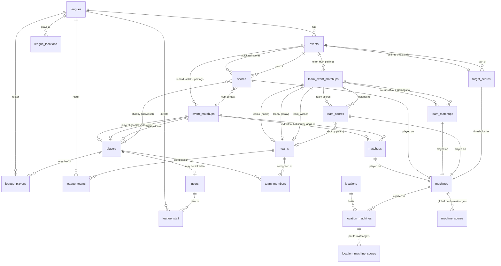

# PinBowling — Database Schema & Relationships

> Reference for how leagues, events, matchups, scores, and target scores are
> structured. Use this alongside `docs/architecture.md` when reviewing session
> generation (`scripts/pages/playPage.js` → `scripts/services/sessionFinalizer.js`)
> and the scoring engines (`scripts/core/engines/`).

## Design Principles

1. **Format-agnostic storage.** Tables use neutral column names
   (`player1_id`, `player2_id`, `team1_id`, `team2_id`,
   `player1_score`, `player2_score`, `order_number`, `value1`, `value2`).
   No format-specific terminology lives in the schema. Each scoring engine
   is responsible for translating these columns into format vocabulary:
   - **Baseball (team)** — `team_event_matchups.team1_id` = Home team, `team2_id` = Away team;
     `team1_score`/`team2_score` = Home Runs / Away Runs;
     `round_name` = half-inning label ("Top N" / "Bottom N");
     `team_matchups.team1_id`/`team2_id` = Pitching Team / Batting Team per half-inning slot;
     `team_scores.ball1_player_id`..`ball3_player_id` = batter assigned by lineup rotation per ball.
   - **Baseball (individual)** — `event_matchups.player1_id` = Home, `player2_id` = Away;
     `player1_score`/`player2_score` = Home Runs / Away Runs;
     `order_number` on `matchups` = half-inning slot (Top/Bottom of inning N).
   - **Bowling / Golf** — `player1`/`player2` are unused (individual formats);
     `order_number` on `scores`/`target_scores` = frame number / hole number.
2. **Explicit separation of Team and Individual tables (Migration 11).**
   - Individual competitions use `event_matchups`, `matchups`, and `scores`.
   - Team competitions use `team_event_matchups`, `team_matchups`, and `team_scores`.
   - Eliminates complex conditional checks (`if participation === 'team'`) across API controllers and SQL queries.
3. **Dedicated League and Session lifecycles (Migration 10).**
   - Standard multi-event leagues live in `leagues`.
   - Quick Play sessions are managed separately without cluttering `leagues`.
4. **Targets vs. Scores.** `target_scores` defines the *expected* thresholds
   per machine per round (par for golf, run baseline for baseball, frame
   baseline for bowling). `scores` and `team_scores` record what each participant *actually* shot.

---

## Entity Relationship Diagram

---

## Table Reference

### `leagues` — Top-level container

| Column | Type | Notes |
|---|---|---|
| `id` | int PK auto | |
| `name` | varchar(255) | League name |
| `participation_type` | enum(`individual`,`team`) | Controls roster storage: `individual` uses `league_players`, `team` uses `league_teams` + `team_members` |
| `team_size` | int default 1 | `1` for individual play, `> 1` for multi-player teams |
| `start_date` | date | |
| `scoring_format` | varchar(50) | `bowling` / `golf` / `baseball` |
| `season_scoring` | enum(`cumulative`,`weekly`) | Season aggregation strategy |
| `drop_lowest_weeks` | int | Season scoring tweak |
| `weekly_points` | int (nullable) | Season config |
| `point_spread` | int (nullable) | Season config |
| `rounds_per_game` | int (nullable) | Number of rounds in a game. Bowling = 10 (full), Golf = 9 or 18, Baseball = innings. |
| `matchups_per_round` | int (nullable) | Number of 1-on-1 matchup rows per round. |
| `weeks_in_season` | int (nullable) | Number of weeks/events in a standard season |
| `status` | enum(`setup`,`active`,`completed`) | |
| `playoff_series_length` | int (nullable) | Number of games per playoff series |

**Relationships:** 1→many `events`, `league_players`, `league_teams`,
`league_staff`, `league_locations`.

---

### `events` — A single date of play within a league

| Column | Type | Notes |
|---|---|---|
| `id` | int PK auto | |
| `league_id` | int FK→`leagues.id` | |
| `event_name` | varchar(255) | |
| `event_date` | date | |
| `location_id` | int FK→`locations.id` (nullable) | |
| `scoring_format` | varchar(50) | Denormalized from league for convenience |

**Relationships:** belongs to `leagues`; has many `scores`, `target_scores`,
`event_matchups`, `team_event_matchups`.

---

### `event_matchups` — Individual head-to-head pairings

Used **only for individual head-to-head** (Baseball) formats.

| Column | Type | Notes |
|---|---|---|
| `id` | int PK auto | |
| `event_id` | int FK→`events.id` | |
| `player1_id` | int FK→`players.id` | Home player |
| `player2_id` | int FK→`players.id` (nullable) | Away player |
| `player1_score` | int default 0 | Home Runs |
| `player2_score` | int default 0 | Away Runs |
| `player3_id` / `player4_id` | int FK→`players.id` (nullable) | Multi-player individual assignments |
| `player3_score` / `player4_score` | int default 0 | Multi-player individual scores |
| `player_winner_id` | int FK→`players.id` (nullable) | Resolved when `status='completed'` |
| `status` | enum(`pending`,`completed`) | |
| `game_number` | int default 1 | For multi-game series within one event |
| `round_name` | varchar(50) (nullable) | Optional round label |

---

### `team_event_matchups` — Team head-to-head pairings

Used **only for team head-to-head** (Team Baseball) formats.

| Column | Type | Notes |
|---|---|---|
| `id` | int PK auto | |
| `event_id` | int FK→`events.id` | |
| `location_id` | int FK→`locations.id` (nullable) | |
| `team1_id` | int FK→`teams.id` | Home team |
| `team2_id` | int FK→`teams.id` (nullable) | Away team |
| `team3_id` / `team4_id` | int FK→`teams.id` (nullable) | Multi-team assignments |
| `team1_score` / `team2_score` | int default 0 | Home / Away Runs |
| `team3_score` / `team4_score` | int default 0 | Multi-team scores |
| `team_winner_id` | int FK→`teams.id` (nullable) | Resolved when `status='completed'` |
| `status` | enum(`pending`,`completed`) | |
| `game_number` | int default 1 | For multi-game series within one event |
| `round_name` | varchar(50) (nullable) | Half-inning label, e.g. `"Top 1"`, `"Bottom 2"` |

---

### `matchups` — Individual matchups per round

| Column | Type | Notes |
|---|---|---|
| `id` | int PK auto | |
| `event_matchup_id` | int FK→`event_matchups.id` | Grouping parent |
| `order_number` | int | Sequential matchup index (1-based) within the game |
| `machine_id` | int FK→`machines.id` | Machine played |
| `player1_id` | int FK→`players.id` (nullable) | Player 1 / Pitcher |
| `player2_id` | int FK→`players.id` (nullable) | Player 2 / Batter |

---

### `team_matchups` — Team matchups per round

| Column | Type | Notes |
|---|---|---|
| `id` | int PK auto | |
| `team_event_matchup_id` | int FK→`team_event_matchups.id` | Grouping parent |
| `order_number` | int | Sequential matchup index (1-based) |
| `machine_id` | int FK→`machines.id` | Machine played |
| `team1_id` | int FK→`teams.id` (nullable) | Pitching team for this half-inning slot |
| `team2_id` | int FK→`teams.id` (nullable) | Batting team for this half-inning slot |
| `team3_id` / `team4_id` | int FK→`teams.id` (nullable) | Multi-team slot roles |

---

### `scores` — Individual scores per round/machine

| Column | Type | Notes |
|---|---|---|
| `id` | int PK auto | |
| `event_id` | int FK→`events.id` | |
| `event_matchup_id` | int FK→`event_matchups.id` (nullable) | Set for head2head formats |
| `player_id` | int FK→`players.id` **NOT NULL** | Individual score owner |
| `order_number` | int | Round/frame/hole/half-inning index |
| `machine_id` | int FK→`machines.id` | Machine played |
| `ball1` / `ball2` / `ball3` | bigint | Ball scores recorded |
| `match_key` | varchar(100) STORED GENERATED | Composite key for upserts |

---

### `team_scores` — Team scores per half-inning/machine

| Column | Type | Notes |
|---|---|---|
| `id` | int PK auto | |
| `team_event_matchup_id` | int FK→`team_event_matchups.id` | Grouping parent |
| `team_id` | int FK→`teams.id` | Team score owner |
| `machine_id` | int FK→`machines.id` | Machine played |
| `order_number` | int | Half-inning slot index |
| `ball1` / `ball2` / `ball3` | bigint | Ball scores recorded |
| `ball1_player_id` | int FK→`players.id` (nullable) | Player who shot ball 1 |
| `ball2_player_id` | int FK→`players.id` (nullable) | Player who shot ball 2 |
| `ball3_player_id` | int FK→`players.id` (nullable) | Player who shot ball 3 |

| Column | Type | Notes |
|---|---|---|
| `id` | int PK auto | |
| `event_id` | int FK→`events.id` | |
| `machine_id` | int FK→`machines.id` | |
| `order_number` | int | Round/frame/hole/half-inning index |
| `value1` | bigint | **Engine-translated**: Strike score (bowling), Target Score/baseline (golf), Run baseline (baseball) |
| `value2` | decimal(12,3) | **Engine-translated**: 1-pin baseline (bowling), Par value per hole (golf), Exponential multiplier (baseball) |
| `score1`…`score10` | bigint | Pre-computed threshold ladder (10 pin levels for bowling, 10 stroke thresholds for golf, 10 run levels for baseball) |

**Relationships:** belongs to `events`, `machines`.

> `value1`/`value2` are intentionally generic. The engine interprets them:
> - **Baseball**: `value1` = run baseline; `value2` = exponential multiplier.
> - **Golf**: `value1` = target score (the pinball score threshold anchored at par); `value2` = par value for the hole (3/4/5). `value2` drives `buildRoundValues`, cumulative-par display, and hole row highlighting.
> - **Bowling**: `value1` = strike score (the 10-pin threshold); `value2` = 1-pin baseline score. Both are passed to `buildRoundValues` to interpolate the full 1–10 pin ladder.

---

### `machines` — Master pinball machine registry

| Column | Type | Notes |
|---|---|---|
| `id` | int PK auto | |
| `machine_name` | varchar(255) UNIQUE | |
| `year` | int (nullable) | |
| `manufacturer` | varchar(255) (nullable) | |

**Relationships:** has many `machine_scores`, `location_machines`,
`matchups`, `scores`, `target_scores`.

---

### `machine_scores` — Global per-format target defaults for a machine

| Column | Type | Notes |
|---|---|---|
| `id` | int PK auto | |
| `machine_id` | int FK→`machines.id` | |
| `format` | varchar(50) | `bowling` / `golf` / `baseball` |
| `target_easy` / `target_med` / `target_hard` | bigint | Difficulty thresholds |

**Relationships:** belongs to `machines`.

> Fallback when no location-specific override exists.

---

### `locations` — Venues

| Column | Type | Notes |
|---|---|---|
| `id` | int PK auto | |
| `name` | varchar(255) | |
| `city` / `state` | varchar(255) (nullable) | |

**Relationships:** has many `location_machines`, `league_locations`,
`events` (via `location_id`).

---

### `location_machines` — Machines installed at a location

| Column | Type | Notes |
|---|---|---|
| `id` | int PK auto | |
| `location_id` | int FK→`locations.id` | |
| `machine_id` | int FK→`machines.id` | |

**Relationships:** belongs to `locations`, `machines`; has many
`location_machine_scores`.

---

### `location_machine_scores` — Location-specific per-format target overrides

| Column | Type | Notes |
|---|---|---|
| `id` | int PK auto | |
| `location_machine_id` | int FK→`location_machines.id` | |
| `format` | varchar(50) | |
| `target_easy` / `target_med` / `target_hard` | bigint | |

**Relationships:** belongs to `location_machines`.

> Takes precedence over `machine_scores` when resolving targets for a session
> generated at a specific location.

---

### `players` — People who play

| Column | Type | Notes |
|---|---|---|
| `id` | int PK auto | |
| `player_name` | varchar(255) UNIQUE | |
| `ifpa_id` / `matchplay_id` | varchar(50) (nullable) | External IDs |

**Relationships:** has many `league_players`, `team_members`, `scores`,
`event_matchups` (as player1/player2/winner); may be linked 1:1 to a `users`
row.

---

### `users` — Auth accounts

| Column | Type | Notes |
|---|---|---|
| `id` | int PK auto | |
| `username` | varchar(255) UNIQUE | |
| `password_hash` | varchar(255) | |
| `email` | varchar(255) UNIQUE (nullable) | |
| `reset_token` / `reset_token_expires` | (nullable) | Password reset flow |
| `role` | enum(`player`,`td`,`admin`) | RBAC |
| `player_id` | int FK→`players.id` UNIQUE (nullable) | Optional link to a player profile |

**Relationships:** has many `league_staff`; optional 1:1 with `players`.

---

### `teams` — Grouped players

| Column | Type | Notes |
|---|---|---|
| `id` | int PK auto | |
| `name` | varchar(255) | |
| `city` / `state` | varchar(255) (nullable) | |
| `created_at` | timestamp | |

**Relationships:** has many `team_members`, `league_teams`.

---

### `teams` / `team_members` — Roster join tables

| Table | PK | FKs | Purpose |
|---|---|---|---|
| `league_players` | (`league_id`,`player_id`) | →`leagues`, →`players` | Individual roster |
| `league_teams` | (`league_id`,`team_id`) | →`leagues`, →`teams` | Team roster |
| `league_staff` | (`league_id`,`user_id`) | →`leagues`, →`users` | TDs directing a league |
| `league_locations` | (`league_id`,`location_id`) | →`leagues`, →`locations` | Where a league plays |
| `team_members` | (`team_id`,`player_id`) | →`teams`, →`players` | Players on a team |

---

### `schema_migrations` — Migration tracking

| Column | Type | Notes |
|---|---|---|
| `migration_name` | varchar(255) PK | |
| `applied_at` | timestamp | |

Managed by `migrate.php`. Not application data.

---

## Session Generation Flow (Baseball)

This traces how a Quick Play session materializes rows across these tables.
Refer to `scripts/pages/playPage.js` (`generatePreview`) and
`scripts/services/sessionFinalizer.js` (`finalizeSession`).

### Individual Baseball

1. **`leagues`** — `finalizeSession` calls `PB_API.leagues.create` with
   `type:'session'`, `scoring_format:'baseball'`, `participants:'head2head'`,
   `rounds_per_game: generatedFrames.length / 2` (the inning count) and
   `matchups_per_round: 2` (top + bottom per inning).
2. **`events`** — One event created for the session date.
3. **`target_scores`** — One row per generated frame (machine + order_number +
   value1/value2 + pre-computed `score1..score10` ladder). For a 2-inning
   baseball game this is **4 rows** (Top 1, Bottom 1, Top 2, Bottom 2).
4. **`league_players`** — Current user joined; opponent added via dialog if
   roster < 2.
5. **`event_matchups`** — Created by `api/matchup.php` POST handler when the
   first matchup payload arrives (resolves player1=home, player2=away).
   **One row** per head-to-head pairing.
6. **`matchups`** — `BaseballEngine.generateMatchupPayload` →
   `buildRoundRobinMatchups(players, inningCount, machines)` produces
   `inningCount × 2` rows (one per half-inning slot), each pointing at the
   `event_matchup_id` and a `machine_id`. For 2 innings → **4 rows**.

### Team Baseball

For team leagues (`leagues.participation_type = 'team'`), the model differs:

1. **`leagues`** — Created with `participation_type:'team'`, `scoring_format:'baseball'`.
2. **`events`** — One event per week.
3. **`target_scores`** — Same as individual: one row per half-inning slot.
4. **`event_matchups`** — **One row per half-inning** (not per pairing). A
   2-inning team game creates **4 rows** (Top 1, Bottom 1, Top 2, Bottom 2). Each row has:
   - `player1_id` = home team ID, `player2_id` = away team ID
   - `round_name` = `"Top N"` or `"Bottom N"`
5. **`matchups`** — Each `event_matchup` has exactly **1 matchup row** (one machine per
   half-inning). The batting order rotation — Ball 1 → Batter 1, Ball 2 → Batter 2, etc. —
   is resolved at scoring time by the `Set Batting Order` dialog, not by pre-creating
   separate rows per batter.
6. **`scores`** — Team baseball uses `team_id`-keyed rows (one per half-inning).
   `player_id` is NULL for these rows. `team_id` = the team that scored in that half-inning.

### Score ownership by format

| Format | `scores.player_id` | `scores.team_id` | Why |
|---|---|---|---|
| Bowling / Golf (individual) | Player ID | NULL | Each player has their own score sheet |
| Individual Baseball H2H | Player ID | NULL | Each player records their own balls |
| Team Baseball H2H | NULL | Team ID | The half-inning score belongs to the team, not one player |
| Team Bowling (future) | Player ID | NULL | Each player on the team still bowls their own game |

### Expected row counts for a 2-inning baseball session

| Table | Individual | Team | Why |
|---|---|---|---|
| `leagues` | 1 | 1 | The session/standard league |
| `events` | 1 | 4 (one per week) | Individual = session; Team = standard |
| `target_scores` | 4 | 4 per event | 2 innings × 2 half-innings |
| `event_matchups` | 1 | 4 per event | Individual = 1 pairing; Team = 1 per half-inning |
| `matchups` | 4 | 4 per event | Individual = 4 half-inning slots; Team = 1 machine per half-inning |
| `scores` (per team/player) | 4 rows (player-keyed) | 4 rows (team-keyed) | One score row per half-inning |
| `league_players` or `league_teams` | 2 | 2 teams | Home + Away |

If you observe unexpected row counts, check the payload generation path
(`buildRoundRobinMatchups` in `scripts/services/matchupBuilder.js` for individual,
or `SeasonService::startSeason` for team) or the `inningCount` argument.

---

## Format Translation Matrix

How engines interpret generic schema columns under the Universal Team Model:

| Generic Column | Bowling | Golf | Baseball (Universal Team Model) |
|---|---|---|---|
| `leagues.team_size` | `1` (Individual team of 1) | `1` (Individual team of 1) | `1` (Individual team of 1) or `> 1` (Multi-player team) |
| `leagues.rounds_per_game` | Frames per game (10 full; sessions often 3/6/10) | Holes per game (9 or 18) | Innings per game (2, 4, 6, 9) |
| `leagues.matchups_per_round` | 1 (Individual round) | 1 (Individual round) | Matchup rows per inning (e.g. 2 for half-innings, 6 for 3-ball turns) |
| `event_matchups.player1_id` | Competitor 1 (Team of 1) | Competitor 1 (Team of 1) | Home Team ID |
| `event_matchups.player2_id` | Competitor 2 (Team of 1) | Competitor 2 (Team of 1) | Away Team ID |
| `event_matchups.player1_score` | Total Points | Total Strokes vs Par | Home Runs |
| `event_matchups.player2_score` | Total Points | Total Strokes vs Par | Away Runs |
| `matchups.order_number` | Frame # | Hole # | 1-based matchup index across the game |
| `matchups.player1_id` | Active Player | Active Player | Pitcher (defensive player assigned for half-inning) |
| `matchups.player2_id` | — | — | Batter (offensive player assigned by lineup rotation) |
| `scores.order_number` | Frame # | Hole # | Matchup `order_number` |
| `target_scores.value1` | Strike score (10-pin threshold) | Target Score (anchored at par) | Run baseline |
| `target_scores.value2` | 1-pin baseline score | Par value per hole (3/4/5) | Exponential multiplier (e.g. 1.5) |
| `target_scores.score1..10` | Pin thresholds (1-pin → strike) | Stroke thresholds (1 stroke → 10 strokes) | Run thresholds (1R..10R) |

---

## Schema Design Principles & Implementation Guidelines

1. **Universal Team Model:** All competitions treat participants as teams (`team_size = 1` for individuals). This unifies fixture generation (`MatchupGenerator`) and scoring engine calculations into a single execution path. Roster storage branches on `leagues.participation_type`: `individual` leagues use `league_players`, `team` leagues use `league_teams` + `team_members`.
2. **Single Source of Truth for Calculations:** Scoring logic lives exclusively within the scoring engine classes (`BaseballEngine.js`, `BowlingEngine.js`, `GolfEngine.js`). Database storage holds raw inputs (`ball1`, `ball2`, `ball3`, `value1`, `value2`), eliminating duplicate calculation engines on the server.
3. **Format-Neutral Matchups:** Every `matchups` row connects participants via `player1_id`/`player2_id` (individual) or `team1_id`/`team2_id` (team) on a `machine_id`. Engines translate these columns into sport-specific roles at runtime.

