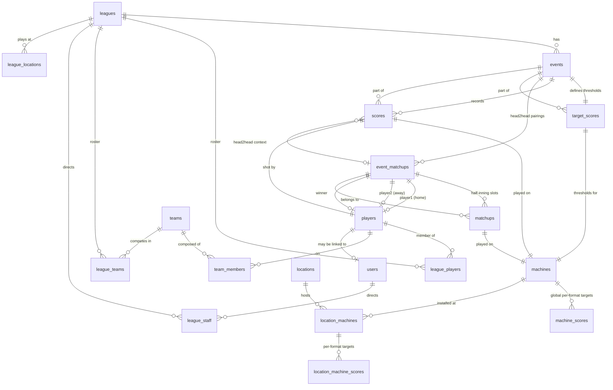

# PinBowling — Database Schema & Relationships

> Reference for how leagues, events, matchups, scores, and target scores are
> structured. Use this alongside `docs/architecture.md` when reviewing session
> generation (`scripts/pages/playPage.js` → `scripts/services/sessionFinalizer.js`)
> and the scoring engines (`scripts/core/engines/`).

## Design Principles

1. **Format-agnostic storage.** Tables use neutral column names
   (`player1_id`, `player2_id`, `player3_id`, `player4_id`,
   `player1_score`, `player2_score`, `order_number`, `value1`, `value2`).
   No format-specific terminology lives in the schema. Each scoring engine
   is responsible for translating these columns into format vocabulary:
   - **Baseball (team)** — `player1` = Home team, `player2` = Away team;
     `player1_score`/`player2_score` = Home Runs / Away Runs;
     `round_name` = half-inning label ("Top N" / "Bottom N");
     `matchups.player_id` = batter assigned by rotation.
   - **Baseball (individual)** — `player1` = Home, `player2` = Away;
     `player1_score`/`player2_score` = Home Runs / Away Runs;
     `order_number` on `matchups` = half-inning slot (Top/Bottom of inning N).
   - **Bowling / Golf** — `player1`/`player2` are unused (individual formats);
     `order_number` on `scores`/`target_scores` = frame number / hole number.
2. **Two participation models.**
   - `leagues.participation_type = 'individual'` — everyone plays everyone
     (Bowling, Golf). Roster via `league_players`.
   - `leagues.participation_type = 'team'` — teams compete (Team Baseball).
     Roster via `league_teams` → `team_members`.
   - `leagues.participants = 'head2head'` — paired play (Individual Baseball).
     Pairings tracked through `event_matchups` + `matchups`.
3. **Two league lifecycles.**
   - `leagues.type = 'session'` — a one-off single-event session (Quick Play).
   - `leagues.type = 'standard'` — a multi-event league spanning weeks/season.
4. **Targets vs. Scores.** `target_scores` defines the *expected* thresholds
   per machine per round (par for golf, run baseline for baseball, frame
   baseline for bowling). `scores` records what each player *actually* shot.

---

## Entity Relationship Diagram

---

## Table Reference

### `leagues` — Top-level container

| Column | Type | Notes |
|---|---|---|
| `id` | int PK auto | |
| `name` | varchar(255) | League or session name |
| `type` | enum(`standard`,`session`) | `session` = Quick Play one-off; `standard` = multi-week |
| `participants` | enum(`individual`,`team`,`head2head`) | `head2head` for Individual Baseball; `team` for Team Baseball |
| `start_date` | date | |
| `scoring_format` | varchar(50) | `bowling` / `golf` / `baseball` |
| `season_scoring` | enum(`cumulative`,`weekly`) | Season aggregation strategy |
| `drop_lowest_weeks` | int | Season scoring tweak |
| `weekly_points` | int (nullable) | Season config (standard leagues) |
| `point_spread` | int (nullable) | Season config (standard leagues) |
| `rounds_per_game` | int (nullable) | Number of rounds in a game. Bowling = 10 (full), sessions often 3/6/10. Golf = 9 or 18. Baseball = innings. For a `standard` league, may be `NULL` if rounds are driven by `target_scores` row count instead. |
| `matchups_per_round` | int (nullable) | **Head2head only.** Number of paired matchups within a round. Individual Baseball = 2 (top/bottom). Team Baseball = team size (batters per half-inning). `NULL` for individual formats (bowling/golf). Total `matchups` rows for a head2head game = `rounds_per_game * matchups_per_round`. |
| `weeks_in_season` | int (nullable) | Number of weeks/events in a standard season |
| `status` | enum(`setup`,`active`,`completed`) | |
| `playoff_series_length` | int (nullable) | Number of games per playoff series |

**Relationships:** 1→many `events`, `league_players`, `league_teams`,
`league_staff`, `league_locations`.

> Game sizing is split across two independent columns (`rounds_per_game` ×
> `matchups_per_round`) instead of a single combined count, so the schema
> has no opinion about how many sides a head2head format has. The engine
> materializes `rounds_per_game * matchups_per_round` rows in the `matchups`
> table when a head2head event is created.

---

### `events` — A single date of play within a league

| Column | Type | Notes |
|---|---|---|
| `id` | int PK auto | |
| `league_id` | int FK→`leagues.id` | |
| `event_name` | varchar(255) | |
| `event_date` | date | |
| `location_id` | int FK→`locations.id` (nullable) | |
| `scoring_format` | varchar(50) | Denormalized from league for convenience |

**Relationships:** belongs to `leagues`; has many `scores`, `target_scores`,
`event_matchups`.

> For a `session`-type league, there is typically exactly one event. For a
> `standard` league, each week of play is a separate `events` row.

---

### `event_matchups` — A single head-to-head pairing within an event

Used **only for `head2head` (Baseball)** formats. Individual formats skip this
table entirely.

| Column | Type | Notes |
|---|---|---|
| `id` | int PK auto | |
| `event_id` | int FK→`events.id` | |
| `player1_id` | int FK→`players.id` | **Engine-translated**: Home team (team) or Home player (individual) |
| `player2_id` | int FK→`players.id` (nullable) | **Engine-translated**: Away team (team) or Away player (individual) |
| `player1_score` | int default 0 | **Engine-translated**: Home Runs |
| `player2_score` | int default 0 | **Engine-translated**: Away Runs |
| `player3_id` | int FK→`players.id` (nullable) | Reserved for future use (generic column) |
| `player4_id` | int FK→`players.id` (nullable) | Reserved for future use (generic column) |
| `player3_score` | int default 0 | Reserved for future use |
| `player4_score` | int default 0 | Reserved for future use |
| `winner_id` | int FK→`players.id` (nullable) | Resolved when `status='completed'` |
| `status` | enum(`pending`,`completed`) | |
| `game_number` | int default 1 | For multi-game series within one event |
| `round_name` | varchar(50) (nullable) | Team baseball only. Half-inning label, e.g. `"Top 1"`, `"Bottom 2"`. Individual mode: NULL. |

**Relationships:** belongs to `events`; has many `matchups` (the half-inning
slots); references `players` three times (player1, player2, winner).

> **Team baseball model:** Each `event_matchups` row represents one half-inning.
> `player1_id` = home team, `player2_id` = away team. The `round_name` field
> stores the half-inning label (e.g. "Top 1"). A 2-inning team game has 4
> `event_matchups` rows (Top 1, Bottom 1, Top 2, Bottom 2), each with N
> `matchups` rows (one per batter in the batting rotation).
>
> **Individual baseball model:** Each `event_matchups` row represents one
> head-to-head pairing between two players. `player1_id` = home player,
> `player2_id` = away player. `round_name` is NULL. A 2-inning game has 1
> `event_matchups` row with 4 `matchups` rows (Top 1, Bottom 1, Top 2, Bottom 2).
>
> The engine layer is responsible for mapping `player1`/`player2` to
> Home/Away and `player1_score`/`player2_score` to Home/Away Runs. The DB
> stores only neutral `player1`/`player2` semantics.

---

### `matchups` — Individual half-inning slots (Baseball)

One row per half-inning per game. For an N-inning baseball game there are
**N × 2** rows here (Top of 1st, Bottom of 1st, Top of 2nd, Bottom of 2nd, …).

| Column | Type | Notes |
|---|---|---|
| `id` | int PK auto | |
| `event_matchup_id` | int FK→`event_matchups.id` (nullable) | Grouping parent |
| `order_number` | int | Sequential slot index (1-based). Engine maps to Top/Bottom of inning N |
| `machine_id` | int FK→`machines.id` | The machine played for this half-inning |
| `player_id` | int FK→`players.id` (nullable) | Team baseball only. The batter assigned to this slot by the batting rotation. Individual mode: NULL. |

**Unique key:** `unique_matchup_round` (`event_matchup_id`, `order_number`) — drives `ON DUPLICATE KEY UPDATE` in matchup saves.

**Relationships:** belongs to `event_matchups`; references `machines`.

> `order_number` semantics by format:
> - **Baseball (individual)**: half-inning slot. `Math.ceil(order/2)` = inning number;
>   odd = Top, even = Bottom. Player assignment derived from
>   `event_matchups.player1_id`/`player2_id` + `order_number` parity.
> - **Baseball (team)**: batter slot within a half-inning. `player_id` stores the
>   batter assigned by the batting rotation. The pitcher is determined at game
>   time by the opposing team.
> - (Unused by Bowling/Golf — those formats use `scores.order_number` and
>   `target_scores.order_number` directly.)

---

### `scores` — Actual player scores per round/machine

| Column | Type | Notes |
|---|---|---|
| `id` | int PK auto | |
| `event_id` | int FK→`events.id` | |
| `event_matchup_id` | int FK→`event_matchups.id` (nullable) | Set for head2head formats |
| `player_id` | int FK→`players.id` | |
| `order_number` | int | Round/frame/hole/half-inning index |
| `machine_id` | int FK→`machines.id` | |
| `ball1` / `ball2` / `ball3` | bigint | The three ball scores for the round |
| `match_key` | varchar(100) STORED GENERATED | Composite key for upserts. Computed from `event_id`/`event_matchup_id` + `order_number` |

**Unique key:** `unique_scores_key` (`player_id`, `match_key`) — drives `ON DUPLICATE KEY UPDATE` in score saves.

**Relationships:** belongs to `events`, `event_matchups` (optional),
`players`, `machines`.

> `order_number` aligns with `matchups.order_number` for baseball (so the
> engine can join a player's balls to the half-inning's machine/targets) and
> with `target_scores.order_number` for bowling/golf.

---

### `target_scores` — Expected thresholds per machine per round

| Column | Type | Notes |
|---|---|---|
| `id` | int PK auto | |
| `event_id` | int FK→`events.id` | |
| `machine_id` | int FK→`machines.id` | |
| `order_number` | int | Round/frame/hole/half-inning index |
| `value1` | bigint | **Engine-translated**: Strike score (bowling), Target Score/baseline (golf), Run baseline (baseball) |
| `value2` | decimal(12,3) | **Engine-translated**: 1-pin baseline (bowling), Par value per hole (golf), Exponential multiplier (baseball) |
| `score1`…`score10` | bigint | Pre-computed threshold ladder (10 pin levels for bowling, 10 stroke thresholds for golf, 10 run levels for baseball) |

**Relationships:** belongs to `events`, `machines`.

> `value1`/`value2` are intentionally generic. The engine interprets them:
> - **Baseball**: `value1` = run baseline; `value2` = exponential multiplier.
> - **Golf**: `value1` = target score (the pinball score threshold anchored at par); `value2` = par value for the hole (3/4/5). `value2` drives `buildRoundValues`, cumulative-par display, and hole row highlighting.
> - **Bowling**: `value1` = strike score (the 10-pin threshold); `value2` = 1-pin baseline score. Both are passed to `buildRoundValues` to interpolate the full 1–10 pin ladder.

---

### `machines` — Master pinball machine registry

| Column | Type | Notes |
|---|---|---|
| `id` | int PK auto | |
| `machine_name` | varchar(255) UNIQUE | |
| `year` | int (nullable) | |
| `manufacturer` | varchar(255) (nullable) | |

**Relationships:** has many `machine_scores`, `location_machines`,
`matchups`, `scores`, `target_scores`.

---

### `machine_scores` — Global per-format target defaults for a machine

| Column | Type | Notes |
|---|---|---|
| `id` | int PK auto | |
| `machine_id` | int FK→`machines.id` | |
| `format` | varchar(50) | `bowling` / `golf` / `baseball` |
| `target_easy` / `target_med` / `target_hard` | bigint | Difficulty thresholds |

**Relationships:** belongs to `machines`.

> Fallback when no location-specific override exists.

---

### `locations` — Venues

| Column | Type | Notes |
|---|---|---|
| `id` | int PK auto | |
| `name` | varchar(255) | |
| `city` / `state` | varchar(255) (nullable) | |

**Relationships:** has many `location_machines`, `league_locations`,
`events` (via `location_id`).

---

### `location_machines` — Machines installed at a location

| Column | Type | Notes |
|---|---|---|
| `id` | int PK auto | |
| `location_id` | int FK→`locations.id` | |
| `machine_id` | int FK→`machines.id` | |

**Relationships:** belongs to `locations`, `machines`; has many
`location_machine_scores`.

---

### `location_machine_scores` — Location-specific per-format target overrides

| Column | Type | Notes |
|---|---|---|
| `id` | int PK auto | |
| `location_machine_id` | int FK→`location_machines.id` | |
| `format` | varchar(50) | |
| `target_easy` / `target_med` / `target_hard` | bigint | |

**Relationships:** belongs to `location_machines`.

> Takes precedence over `machine_scores` when resolving targets for a session
> generated at a specific location.

---

### `players` — People who play

| Column | Type | Notes |
|---|---|---|
| `id` | int PK auto | |
| `player_name` | varchar(255) UNIQUE | |
| `ifpa_id` / `matchplay_id` | varchar(50) (nullable) | External IDs |

**Relationships:** has many `league_players`, `team_members`, `scores`,
`event_matchups` (as player1/player2/winner); may be linked 1:1 to a `users`
row.

---

### `users` — Auth accounts

| Column | Type | Notes |
|---|---|---|
| `id` | int PK auto | |
| `username` | varchar(255) UNIQUE | |
| `password_hash` | varchar(255) | |
| `email` | varchar(255) UNIQUE (nullable) | |
| `reset_token` / `reset_token_expires` | (nullable) | Password reset flow |
| `role` | enum(`player`,`td`,`admin`) | RBAC |
| `player_id` | int FK→`players.id` UNIQUE (nullable) | Optional link to a player profile |

**Relationships:** has many `league_staff`; optional 1:1 with `players`.

---

### `teams` — Grouped players

| Column | Type | Notes |
|---|---|---|
| `id` | int PK auto | |
| `name` | varchar(255) | |
| `city` / `state` | varchar(255) (nullable) | |
| `created_at` | timestamp | |

**Relationships:** has many `team_members`, `league_teams`.

---

### `teams` / `team_members` — Roster join tables

| Table | PK | FKs | Purpose |
|---|---|---|---|
| `league_players` | (`league_id`,`player_id`) | →`leagues`, →`players` | Individual roster |
| `league_teams` | (`league_id`,`team_id`) | →`leagues`, →`teams` | Team roster |
| `league_staff` | (`league_id`,`user_id`) | →`leagues`, →`users` | TDs directing a league |
| `league_locations` | (`league_id`,`location_id`) | →`leagues`, →`locations` | Where a league plays |
| `team_members` | (`team_id`,`player_id`) | →`teams`, →`players` | Players on a team |

---

### `schema_migrations` — Migration tracking

| Column | Type | Notes |
|---|---|---|
| `migration_name` | varchar(255) PK | |
| `applied_at` | timestamp | |

Managed by `migrate.php`. Not application data.

---

## Session Generation Flow (Baseball)

This traces how a Quick Play session materializes rows across these tables.
Refer to `scripts/pages/playPage.js` (`generatePreview`) and
`scripts/services/sessionFinalizer.js` (`finalizeSession`).

### Individual Baseball

1. **`leagues`** — `finalizeSession` calls `PB_API.leagues.create` with
   `type:'session'`, `scoring_format:'baseball'`, `participants:'head2head'`,
   `rounds_per_game: generatedFrames.length / 2` (the inning count) and
   `matchups_per_round: 2` (top + bottom per inning).
2. **`events`** — One event created for the session date.
3. **`target_scores`** — One row per generated frame (machine + order_number +
   value1/value2 + pre-computed `score1..score10` ladder). For a 2-inning
   baseball game this is **4 rows** (Top 1, Bottom 1, Top 2, Bottom 2).
4. **`league_players`** — Current user joined; opponent added via dialog if
   roster < 2.
5. **`event_matchups`** — Created by `api/matchup.php` POST handler when the
   first matchup payload arrives (resolves player1=home, player2=away).
   **One row** per head-to-head pairing.
6. **`matchups`** — `BaseballEngine.generateMatchupPayload` →
   `buildRoundRobinMatchups(players, inningCount, machines)` produces
   `inningCount × 2` rows (one per half-inning slot), each pointing at the
   `event_matchup_id` and a `machine_id`. For 2 innings → **4 rows**.

### Team Baseball

For team leagues (`leagues.participation_type = 'team'`), the model differs:

1. **`leagues`** — Created with `participation_type:'team'`, `rounds_per_game`
   must be a multiple of `team_size` (validated at creation).
2. **`events`** — One event per week.
3. **`target_scores`** — Same as individual: one row per half-inning slot.
4. **`event_matchups`** — **One row per half-inning** (not per pairing). A
   2-inning team game with 3 members per team creates **4 rows**
   (Top 1, Bottom 1, Top 2, Bottom 2). Each row has:
   - `player1_id` = home team, `player2_id` = away team
   - `round_name` = `"Top N"` or `"Bottom N"`
5. **`matchups`** — Each event_matchup has N matchup rows (one per batter in
   the batting rotation). Each row has `player_id` set to the batter assigned
   by the rotation. The pitcher is determined at game time.

### Expected row counts for a 2-inning baseball session

| Table | Individual | Team (3 members) | Why |
|---|---|---|---|
| `leagues` | 1 | 1 | The session/standard league |
| `events` | 1 | 4 (one per week) | Individual = session; Team = standard |
| `target_scores` | 4 | 4 per event | 2 innings × 2 half-innings |
| `event_matchups` | 1 | 4 per event | Individual = 1 pairing; Team = 1 per half-inning |
| `matchups` | 4 | 12 per event | Individual = 4 slots; Team = 4 half-innings × 3 batters |
| `league_players` or `league_teams` | 2 | 2 teams | Home + Away |

If you observe unexpected row counts, check the payload generation path
(`buildRoundRobinMatchups` in `scripts/services/matchupBuilder.js` for individual,
or `SeasonService::startSeason` for team) or the `inningCount` argument.

---

## Format Translation Matrix

How engines interpret the generic columns:

| Generic Column | Bowling | Golf | Baseball (Individual) | Baseball (Team) |
|---|---|---|---|---|
| `leagues.participation_type` | `individual` | `individual` | `individual` (via `head2head`) | `team` |
| `leagues.rounds_per_game` | Frames per game (10 full; sessions often 3/6/10) | Holes per game (9 or 18) | Innings per game | Innings per game (must be multiple of team size) |
| `leagues.matchups_per_round` | — | — | Sides per inning (2) | Batters per half-inning (team size) |
| `event_matchups.player1_id` | — | — | Home player | Home team |
| `event_matchups.player2_id` | — | — | Away player | Away team |
| `event_matchups.player1_score` | — | — | Home Runs | Home Runs |
| `event_matchups.player2_score` | — | — | Away Runs | Away Runs |
| `event_matchups.round_name` | — | — | NULL | `"Top N"` / `"Bottom N"` |
| `matchups.order_number` | — | — | Half-inning slot (1-based; odd=Top, even=Bottom) | Batter slot within half-inning |
| `matchups.player_id` | — | — | NULL (derived from event_matchups) | Batter assigned by rotation |
| `scores.order_number` | Frame # | Hole # | Half-inning slot | Batter slot within half-inning |
| `target_scores.value1` | Strike score (10-pin threshold) | Target Score (anchored at par) | Run baseline | Run baseline |
| `target_scores.value2` | 1-pin baseline score | Par value per hole (3/4/5) | Exponential multiplier | Exponential multiplier |
| `target_scores.score1..10` | Pin thresholds (1-pin → strike) | Stroke thresholds (1 stroke → 10 strokes) | Run thresholds (1R..10R) | Run thresholds (1R..10R) |

---

## Open Schema Notes

- `event_matchups` is only populated for `head2head` formats. Bowling/Golf
  events have no rows here; their scores join directly to `events`.
- `scores.event_matchup_id` is nullable for the same reason — individual
  formats leave it NULL.
- `matchups.player_id` is set for team baseball (the batter assigned by the
  batting rotation) and NULL for individual baseball (player assignment is
  derived from the parent `event_matchups.player1_id`/`player2_id` plus the
  `order_number` parity).
- `event_matchups.round_name` is set for team baseball (half-inning label like
  "Top 1") and NULL for individual baseball.
- `event_matchups.player3_id`/`player4_id` are reserved generic columns
  following the same neutral naming convention as `player1_id`/`player2_id`.
  Different formats can interpret them differently in the future.
- Game sizing for head2head formats is the product of
  `leagues.rounds_per_game` and `leagues.matchups_per_round`. The schema
  stores these as two independent columns (rather than a single
  combined count) so it has no opinion about how many sides a head2head
  format has. For individual formats (bowling/golf), `rounds_per_game`
  is the frame/hole count and `matchups_per_round` is unused.
